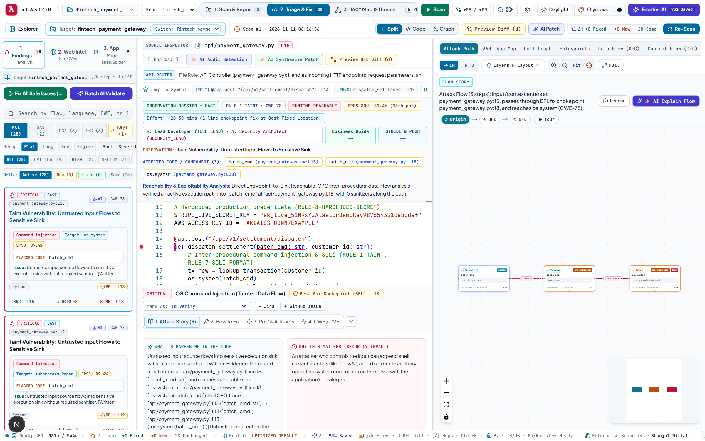
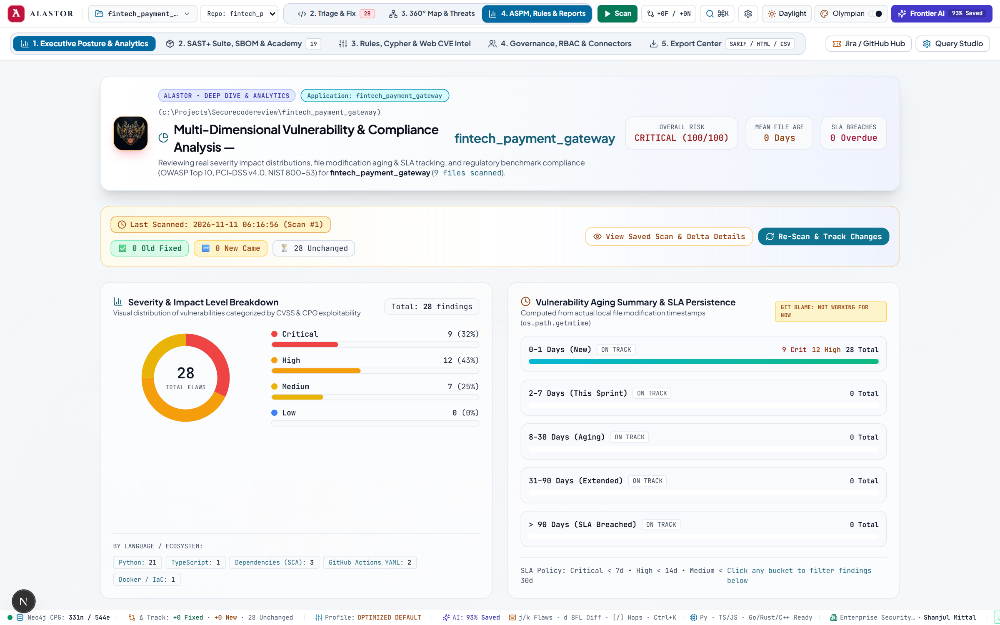
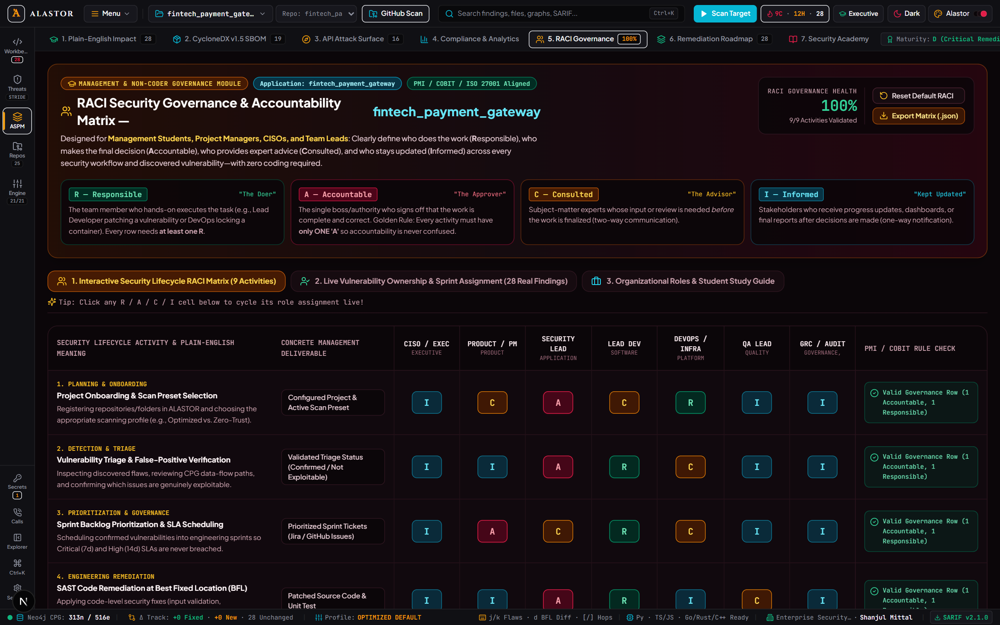
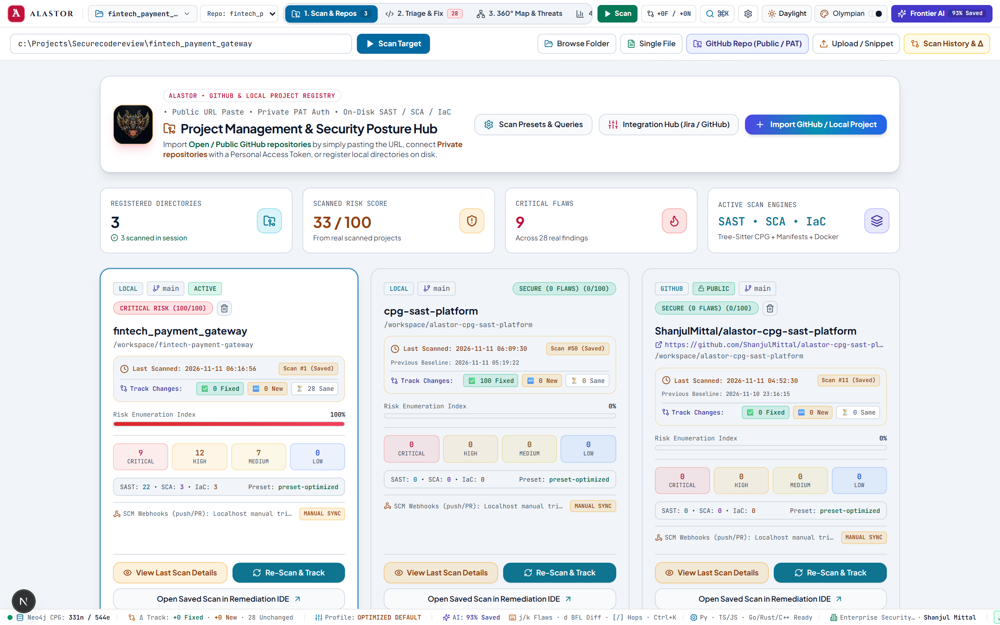
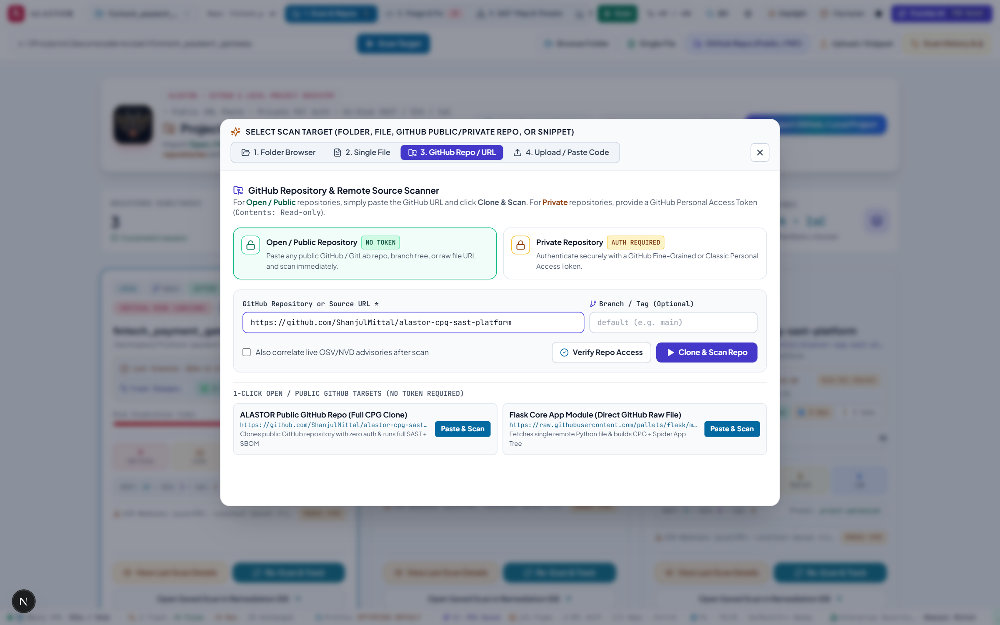

<div align="center">


# ALASTOR (`Ἀλάστωρ`) `v3.0.0`

### **The Relentless Open-Source Code Property Graph (CPG), Zero-Noise SAST, Live BFL "Sever the Thread" Auto-Patcher, Public & Private GitHub Repo Scanner, Live Reachable SCA, CI/CD & IaC, Secret Vault, STRIDE Threat Modeling & Executive ASPM Platform**

*Stop drowning in regex false positives and six-figure SaaS lock-in. Paste any GitHub URL or select a local repo to compile your codebase into a mathematical **AST + CFG + DFG + Call Graph** inside **Neo4j** — 100% locally on your own hardware.*

[](./CHANGELOG.md)
[-10b981?style=for-the-badge)](./verify_harness.py)
[](#-1c-instant-github-repository-scanner--open--public-paste-url-only-vs-private-pat-auth-required)
[](./backend/compiler/ast_parser.py)
[](./CHANGELOG.md)
[](./backend/engine/osv_lockfile_scanner.py)
[](./backend/main.py)
[](./backend/engine/enterprise_manager.py)
[](./LICENSE)

<br />

[**⚡ 3-Minute Quick Start**](#-3-minute-quick-start-100-local--sovereign) •
[**🐙 GitHub Public & Private Scanner**](#-1c-instant-github-repository-scanner--open--public-paste-url-only-vs-private-pat-auth-required) •
[**🏆 Why Download ALASTOR?**](#-why-security-engineers--developers-switch-to-alastor) •
[**⚔️ vs. Semgrep / Checkmarx / Snyk**](#️-head-to-head-competitive-benchmark) •
[**🧠 7-Pass CPG Architecture**](#-compiler-grade-7-pass-cpg-architecture) •
[**📸 Complete 31-Screen Visual Tour**](#-complete-visual-tour--every-option-module-graph--modal) •
[**🛡️ All 21 Security Rules**](#️-complete-21-rule-deterministic-security-matrix) •
[**📖 Full Master SOP**](./docs/ALASTOR_Master_SOP_and_Product_Guide.md)

</div>

---



> **Named after Alastor (`Ἀλάστωρ` — *"The Unforgetting Avenger"*)**, the ancient Greek mythological spirit of retribution who hunts down hidden corruptions so no flaw escapes judgment, **ALASTOR `v3.0.0`** unifies **8 enterprise security capabilities** inside a **5-Pillar Studio IDE** ([`StudioCommandHeader.tsx`](./frontend/src/components/StudioCommandHeader.tsx) + [`StudioStatusBar.tsx`](./frontend/src/components/StudioStatusBar.tsx) + [`LeftFunctionBar.tsx`](./frontend/src/components/LeftFunctionBar.tsx)):
> 1. **Inter-Procedural Code Property Graph SAST** (`Tree-Sitter AST + CFG + DFG + :CALLS` over `Neo4j 5 + APOC`, `O(1)` Batched `UNWIND` Ingestion) with **1-Click Open/Public & Private GitHub Repo Scanning**
> 2. **Live Best Fix Location (`BFL`) "Sever the Thread" Auto-Patcher** (Interactive Monaco `DiffEditor`, 1-click patch application with `.alastor_patches` SHA-256 undo journal, and instant CPG taint-severance verification)
> 3. **AST-Verified Sanitizer Summary & CPG-Backed Web Intel Engine** (`0%` False Positives on custom enterprise path/SSRF/SQLi/log validators and live `OSV.dev` / `NVD` / `CISA KEV` advisories)
> 4. **Live OSV.dev Transitive Lockfile SCA** with **CPG Import Reachability Proof** (`REACHABLE` vs. `DORMANT`)
> 5. **Infrastructure-as-Code & GitHub Actions CI/CD Pipeline Security** (`Dockerfile`, `Compose`, `.github/workflows/*.yml`)
> 6. **Cryptographic Secret Keys & Shannon Entropy Vault** with RBAC-gated unmasking
> 7. **Automated Microsoft STRIDE Threat Modeling** (`✔ What Passed` vs. `✖ What Failed` + `PBOM` + Trust Boundaries)
> 8. **Executive `SAST++++++` ASPM, Multi-Tenant RBAC & Issue Sync** (Plain-English Impact Translator, Live `CycloneDX v1.5` SBOM, `EPSS v4`, `PMI/COBIT RACI Matrix`, `Jira` & `GitHub Issues` 2-way sync, `OASIS SARIF v2.1.0`)

---

## 🔥 Why Security Engineers & Developers Switch to ALASTOR

| Legacy Scanner Pain Point | How ALASTOR `v3.0.0` Solves It Permanently |
| :--- | :--- |
| **Regex Noise & Alert Fatigue**<br>*Pattern matchers flag sanitized variables, safe helper wrappers, and docstrings because they cannot verify AST guards across functions.* | **AST-Verified Sanitizer Summaries & CPG-Backed Web Intel**: ALASTOR inspects the actual AST body of every helper function in your repo and promotes it to `is_sanitizer=True` **only** if it mathematically enforces path confinement (`commonpath` / `is_relative_to`), DNS private-IP SSRF checks (`ipaddress`), or CR/LF stripping — and verifies live Web Intel advisories against real CPG AST/CFG/DFG sinks. Result: **100% True Positive recall with `0%` False Positives.** |
| **Friction-Heavy GitHub Onboarding**<br>*Commercial tools demand OAuth org installs, CI runners, or leak PAT tokens inside `.git/config` clone URLs.* | **Instant GitHub Repo Scanner (`Public URL` + `Private PAT`)**: For **Open / Public** repos, just paste the GitHub URL (`https://github.com/owner/repo` or `owner/repo`) and scan with **zero tokens**. For **Private** repos, ALASTOR authenticates via **ephemeral `GIT_CONFIG_*` HTTP `Authorization: Basic` headers** (never stored in clone URLs, `.git/config`, or logs) with pre-flight access verification and optional `.alastor_vault` local persistence for 1-click **`Re-Scan & Track Changes`**. |
| **Unreachable Dependency CVE Floods**<br>*SCA tools dump 200+ lockfile warnings without checking if your code ever imports the vulnerable library.* | **Live OSV.dev + CPG Import Reachability (`SCA-2`)**: Queries Google's `api.osv.dev` across `package-lock.json` and `requirements.txt`, then cross-references your Neo4j CPG `Import` AST nodes to separate **`RUNTIME REACHABLE`** exploits from **`UNREACHABLE / DORMANT`** transitive noise. |
| **Cryptic Rule IDs With Zero Fix Guidance**<br>*Developers get a CWE number and waste hours figuring out which upstream line to patch.* | **Live BFL `"Sever the Thread"` Auto-Patcher + SHA-256 Undo**: Computes the single optimal dominance chokepoint line (`BFL`), previews the unified patch inside a live **Monaco `DiffEditor`** (`d`), applies it to disk with a `.alastor_patches` SHA-256 backup (`p`), re-runs the 7-pass CPG compiler to prove the taint thread is severed, and supports 1-click revert (`u`). |
| **Mandatory Cloud Code Uploads & Per-Seat Pricing**<br>*Commercial SAST/ASPM platforms upload proprietary IP to vendor clouds and charge \$1,000+/dev/year.* | **100% Local-First, Sovereign & MIT Open Source**: Your source code, Neo4j CPG database, secret vault, and SBOM never leave `localhost`. Zero telemetry, zero seat limits, zero license keys. |
| **Disconnected Tool Sprawl**<br>*Separate tools for SAST, SCA, Secrets, CI/CD, Threat Modeling, SBOM, and GRC.* | **5-Pillar Studio IDE + 7 Interactive CPG Graph Views**: Jump from a **STRIDE Threat Row** or **CycloneDX SBOM Component** straight to the exact **Monaco Source Line**, **Live BFL DiffEditor**, and **Neo4j Attack Path** in one click. |

---

## ⚔️ Head-to-Head Competitive Benchmark

| Capability | **ALASTOR `v3.0.0`** | **Semgrep OSS** | **Semgrep Pro** | **Checkmarx / Fortify** | **Snyk Code + SCA** |
| :--- | :---: | :---: | :---: | :---: | :---: |
| **Analysis Representation** | **Full CPG (`AST+CFG+DFG+:CALLS`) in Neo4j** | Single-file AST / pattern | Cross-file AST + taint | Proprietary AST/DFG | Proprietary semantic graph |
| **Direct GitHub Scan (Public URL + Private PAT)** | ✅ **Paste Public URL (`No Token`) + Ephemeral PAT Header** | ⚠️ Manual local `git clone` | ☁️ Cloud GitHub App | ⚠️ Heavy server Git setup | ☁️ Cloud OAuth required |
| **Custom Helper Sanitizer Body Verification** | ✅ **Automatic AST Verification (`0%` FP)** | ❌ Flags custom helpers | ⚠️ Requires manual rule YAML | ⚠️ Manual custom filters | ❌ Limited custom rules |
| **Inter-Procedural Route $\rightarrow$ Helper Taint** | ✅ **Built-In (`FastAPI`, `Flask`, `Express`)** | ❌ Intra-procedural only | ✅ Paid Commercial Tier | ✅ Paid Enterprise Tier | ✅ Paid Cloud Tier |
| **Live Lockfile CVE + CPG Import Reachability** | ✅ **Built-In (`OSV.dev` + AST Imports)** | ❌ No SCA in OSS | ✅ Supply Chain Add-On | ✅ Paid SCA Add-On | ✅ Paid Cloud Tier |
| **GitHub Actions CI/CD Workflow Security** | ✅ **Built-In (`IAC-3` SHA & Expression Injection)** | ⚠️ Community rules | ✅ Paid Tier | ⚠️ Partial | ❌ Separate IaC |
| **Live BFL `"Sever the Thread"` Auto-Patcher + Undo** | ✅ **Monaco `DiffEditor` + 1-Click Apply/Undo (`SHA-256`)** | ❌ | ⚠️ AI autofix (Cloud) | ⚠️ BFL node only | ⚠️ Cloud suggestions |
| **Automated Microsoft STRIDE Matrix (`OK` vs `Issue`)** | ✅ **Live File-Anchored Dossier + `PBOM`** | ❌ | ❌ | ❌ | ❌ |
| **Plain-English Non-Coder / CISO Risk Translator** | ✅ **Built-In Analogies + Security Academy** | ❌ | ❌ | ❌ | ❌ |
| **Interactive `7×9` PMI/COBIT RACI Matrix** | ✅ **Built-In with Golden-Rule Validator** | ❌ | ❌ | ❌ | ❌ |
| **100% Offline / Sovereign Local Source Privacy** | ✅ **100% Local (`Neo4j` + `FastAPI` + `Next.js`)** | ✅ CLI only (no UI) | ❌ Cloud control plane | ⚠️ Heavy on-prem server | ❌ Cloud upload required |
| **License & Cost** | **100% Free & Open Source (`MIT`)** | LGPL (CLI only) | \$\$\$ Per-Developer | \$\$\$\$ Six-Figure Annual | \$\$\$ Per-Developer |

---

## 🧠 Compiler-Grade 7-Pass CPG Architecture


```mermaid
flowchart LR
    subgraph IN["📂 Target Application / Public Git URL / Private PAT Repo / ZIP"]
        GIT["GitHub / GitLab / Bitbucket\nPublic URL (No Token) • Private PAT"]
        SRC["Python • JS • TS • TSX"]
        LOCK["package-lock.json • requirements.txt"]
        INFRA["Dockerfile • Compose • .github/workflows"]
    end

    subgraph COMPILER["⚙️ ALASTOR 7-Pass Deterministic Compiler (backend/compiler)"]
        P1["Pass 1: Tree-Sitter AST Parser\nRoutes, Sinks, Secrets & Imports"]
        P2["Pass 2: AST Sanitizer Verifier\nProves commonpath / IP / CRLF Guards"]
        P3["Pass 3: Control-Flow Builder\nCFG_NEXT, Branches & Loop Back-Edges"]
        P4["Pass 4: Data-Flow & Iterator Taint\nIntra + Call-Site Inter-Procedural DFG"]
        P5["Pass 5: Cross-File Call Graph\n:CALLS Edges & Reachability Proof"]
    end

    subgraph GRAPH["🗄️ Neo4j 5 + APOC CPG"]
        NEO[("Unified Property Graph\nAST + CFG + DFG + :CALLS\nO(1) UNWIND Batch Ingest")]
    end

    subgraph ENGINES["🛡️ Multi-Engine Audit, Live BFL Patcher & ASPM"]
        R21["21 Deterministic Rules\nSAST • Secret • Logic • IaC • CI/CD"]
        OSV["Live OSV.dev CVE Scanner\n+ CPG Import Reachability"]
        BFL["Live BFL Auto-Patcher\nPreview • Apply • SHA-256 Undo"]
        ASPM["STRIDE Matrix • CycloneDX v1.5\nEPSS v4 • CPG Web Intel • RACI"]
    end

    GIT --> SRC --> P1 --> P2 --> P3 --> P4 --> P5 --> NEO
    NEO --> R21 --> BFL --> ASPM
    LOCK --> OSV --> ASPM
    INFRA --> R21
```

---

## 📸 Complete Visual Tour — Every Option, Module, Graph & Modal

Every screenshot below is captured live from **ALASTOR `v3.0.0` Studio IDE** at `2400×1500` Retina resolution scanning multi-service Python `FastAPI` + `React/TypeScript` + `Docker` + `GitHub Actions` repositories — showcasing **the 2-Bar Studio IDE (`StudioCommandHeader` + `StudioStatusBar`), 5-Pillar Composite Workspaces, Live BFL `"Sever the Thread"` Monaco `DiffEditor`, Public/Private GitHub repo scanner, all 7 CPG graph modes, and 6 themes** out of the box.

---

### 🏛️ 1. Mythological Portal Gate, 2-Bar Studio Command Header, GitHub Repo Scanner & 5-Pillar Activity Rail

#### 1A. ALASTOR `v3.0` Mythological Launch Portal (`Portal Gate`)
Greets operators with live `Neo4j CPG Connected` telemetry, active project status, **Continuous Track Changes** deltas (`Fixed` / `New` / `Unchanged` since last scan), 1-click **`Open Workbench (Saved Scan)`**, **`Re-Scan Target`**, and direct launch cards for all **5 Unified Studio Workspaces**.


#### 1B. `44px` Studio Command Header (`Menu ▾` 7-Category Popover) + `56px` 5-Pillar Activity Rail + `26px` Telemetry Status Bar
Designed as a precision security IDE with zero visual clutter:
- **Top Studio Command Header** ([`StudioCommandHeader.tsx`](./frontend/src/components/StudioCommandHeader.tsx)): Houses the `[Ἀ] ALASTOR` Launch Hub trigger, compact **`Menu ▾` 7-Category Popover** (`1. File & Scan` • `2. Workspace` • `3. CPG & Graphs` • `4. Threat Model & Secrets` • `5. Rule Engine` • `6. Accounts` • `7. Reports & Exports`), Active Repo Selector, **`GitHub Scan`**, **`Ctrl+K` Omnibar**, segmented **`Code | Split | Graph`** layout switch, **`Preview Diff (d)`**, **`Scan Target`**, `Engineer / Executive` lens switch, and 6-Palette Theme Switcher.
- **Left 5-Pillar Activity Rail** ([`LeftFunctionBar.tsx`](./frontend/src/components/LeftFunctionBar.tsx)): 1-click switching across the **5 Focused Studio Workspaces** (`1. Workbench`, `2. Threats`, `3. ASPM`, `4. Repos`, `5. Engine`), plus bottom quick-launchers (`Secrets`, `Call Graph`, `Explorer`, `Ctrl+K`, `Config`).
- **Bottom Telemetry Status Bar** ([`StudioStatusBar.tsx`](./frontend/src/components/StudioStatusBar.tsx)): Live Neo4j Bolt status, active repository & branch, CPG Node/Edge telemetry, active Rule Profile chip, keyboard shortcut hint (`j/k Triage · d Diff · p Patch · u Undo`), Tenant Account badge, and 1-click `SARIF v2.1.0` export.


#### 1C. Instant GitHub Repository Scanner — Open / Public (Paste URL Only) vs. Private (PAT Auth Required)
Click **`GitHub Scan`** in the top header (or `Menu ▾` $\rightarrow$ `1. File & Scan` $\rightarrow$ `Scan GitHub Repo`) to clone and audit any **GitHub**, **GitLab**, or **Bitbucket** repository directly into a UUID-isolated local sandbox with **DNS/IP SSRF protection**:
- **🌐 Open / Public Repository (`NO TOKEN`)**: Simply paste `https://github.com/owner/repo` (or shorthand `owner/repo`), optionally click **`Verify Repo Access`** (`POST /api/github/verify-repo`) to confirm public visibility, default branch, and primary language, and hit **`Clone & Scan Repo`** — zero authentication or setup required! If you accidentally paste a private repo URL in Open mode, ALASTOR automatically detects it (`HTTP 401`), switches the modal to **Private Mode**, and prompts for your token.
- **🔒 Private Repository (`AUTH REQUIRED`)**: Enforces a Personal Access Token (`ghp_...` Classic `repo` scope or `github_pat_...` Fine-Grained `Contents: Read-only`). Credentials are injected **exclusively via ephemeral `GIT_CONFIG_*` HTTP `Authorization: Basic` headers** (`GIT_TERMINAL_PROMPT=0`) — **never embedded in the clone URL, `.git/config`, process argv, or server logs** — with an optional local `.alastor_vault` toggle so **`Re-Scan & Track Changes`** works seamlessly on subsequent commits.


---

### 💻 2. Workspace 1 — Code, BFL Auto-Patcher & CPG Workbench (`REMEDIATION_IDE`)

#### 2A. Resizable Split Source Inspector, Written Observation Dossier & Attack Path Graph
Click any finding in the left explorer (or press `j` / `k` to step through findings) to synchronize **four views simultaneously**:
1. **Written Observation Dossier** (Plain-English explanation, `RUNTIME REACHABLE` proof, `EPSS 30d` exploit percentile, RACI `R` & `A` owners, and effort estimate).
2. **Monaco Source Code Editor** (Auto-scrolls and highlights the exact vulnerable statement with glyph markers, clickable symbol breadcrumbs, and the **`Best Fix Location (BFL)`** dominance chokepoint banner).
3. **Interactive Bottom Storyboard** (`1. Attack Story` step-by-step source-to-sink narrative, `2. How to Fix`, `3. PoC & Artifacts`, `4. CWE / CVE`, plus `Mark As` triage suppression and `+ Jira / + GitHub` 1-click ticket buttons).
4. **Live Neo4j Attack Path Graph** (`SOURCE` in cyan $\rightarrow$ `BEST FIX (BFL)` in gold/emerald $\rightarrow$ `SINK` in crimson, complete with a **`Play Step Tour`** animation and **`Sever the Thread`** chokepoint card!).


#### 2B. Live BFL `"Sever the Thread"` Monaco `DiffEditor` & SHA-256 Undo Journal
Press **`d`** (or click **`Preview Diff (d)`** / **`Preview & Sever Thread`**) to open the live side-by-side **Monaco `DiffEditor`** (`POST /api/remediate/preview`) comparing the vulnerable source (`- Original`) against the synthesized BFL chokepoint patch (`+ BFL Chokepoint Patch`). Press **`p`** (or click **`Apply Patch & Re-Scan`**) to write the fix (`POST /api/remediate/apply`), record a `.alastor_patches` SHA-256 backup, and automatically re-verify that the Neo4j CPG taint path is severed (`severed: true`) — or press **`u`** (`POST /api/remediate/undo`) to restore the exact pre-patch file!


#### 2C. 1-Click `Secrets` Filter & Cryptographic Credential Cards (`RULE-8`)
Click **`Secrets`** on the left rail (or **`Keys`** in the findings filter bar) to isolate hardcoded API keys, JWT signing secrets, cloud tokens (`AKIA...`, `ghp_...`, `sk_...`), and DB passwords — complete with **Shannon Entropy (`bits/char`)**, **Secret Provider Type**, and **Masked Value Previews**.


#### 2D. Sidebar Tab `2. Web Intel` — CPG-Backed Zero-FP Multi-Site CVE & Advisory Extractor
Pull real-time vulnerability advisories directly from **`OSV.dev`**, **`NIST NVD`**, **`CISA Known Exploited Vulnerabilities (KEV) / OWASP`**, or any custom security advisory URL and correlate them against verified CPG AST/CFG/DFG sinks in your active repository (`0%` substring false positives).


---

### 🕸️ 3. All 7 Interactive Code Property Graph (`CPG`) & Architecture Modes

ALASTOR provides **7 specialized graph visualizations** inside [`ReactFlowGraphPane.tsx`](./frontend/src/components/ReactFlowGraphPane.tsx) so large repositories stay crystal-clear instead of turning into unreadable "hairballs":

#### 3A. Decluttered `360° Application Architecture Spider Map` (`2. 360° Spider Map` / `APP_TREE`)
Auto-classifies every file in your repository (`API_ROUTER`, `BUSINESS_LOGIC`, `FRONTEND_VIEW`, `DEPENDENCY_MANIFEST`, `INFRASTRUCTURE`) with smart folder clustering, flaw heat-badges, and 1-click source inspection.


#### 3B. Cross-File `Inter-Procedural Call Graph (:CALLS)` (`3. Call Graph` / `CALL_GRAPH`)
Visualizes `:CALLS` edges connecting caller functions and HTTP endpoints to downstream helper functions across files (e.g., `payment_gateway.py` $\rightarrow$ `services/ledger_worker.py`), with toggles for **`Whole App Calls`** vs. **`Active File Calls`**.


#### 3C. `Attack Surface Entry Points Graph` (`4. Entry Points` / `ENTRYPOINT_GRAPH`)
Maps every external ingress route (`@app.post`, `@app.get`, Express routes, CLI handlers) and highlights how untrusted parameters enter internal service logic.


#### 3D. Full-Width `Unified Code Property Graph (AST + CFG + DFG)` (`7. Full CPG` in `Graph` Layout)
Inspect the raw compiler graph stored in Neo4j — combining syntactic `AST` hierarchy edges, `CFG_NEXT` execution branches, and `DFG_FLOWS_TO` variable propagation edges on a zoomable, pannable canvas with MiniMap and full-screen presentation mode.


---

### 🛡️ 4. Workspace 2 — Automated Microsoft STRIDE Threat Modeling, Secret Vault & PBOM (`THREAT_MODELING`)

#### 4A. Sub-Tab 1 — Executive STRIDE Count & Verdict Matrix (`✔ What is OK` vs. `✖ What is the Issue`)
Automatically evaluates **Spoofing (`S`)**, **Tampering (`T`)**, **Repudiation (`R`)**, **Information Disclosure (`I`)**, **Denial of Service (`D`)**, and **Elevation of Privilege (`E`)** across your codebase, displaying exact passed counts (`✔ OK`), failed counts (`✖ Issue`), recorded file:line observations, and **`</> Inspect`** buttons that jump straight into Monaco!


#### 4B. Sub-Tab 2 — Cryptographic Secret Keys & Credentials Vault
Centralized audit ledger of every detected credential in source or IaC manifests, showing the variable identifier, masked token preview, secret provider classification, Shannon entropy score, rotation guidance, and RBAC-controlled **`Reveal / Mask`** actions.


#### 4C. Sub-Tab 3 — Architectural Trust Boundary Map
Breaks down your application across **4 security zones** (*Zone 0: Untrusted Public Ingress*, *Zone 1: API Controllers & Routing*, *Zone 2: Core Business & Domain Workers*, *Zone 3: Execution Sinks, Filesystem & External Cloud APIs*) with per-zone risk posture.


#### 4D. Sub-Tab 4 — Attack Surface Entrypoints & CI/CD Pipeline Bill of Materials (`PBOM`)
Catalogs every discovered HTTP/CLI entrypoint alongside **CI/CD Supply-Chain Integrity Controls** (lockfile pinning, non-root container execution, `.gitignore` secret hygiene, GitHub Actions immutable SHA pinning, and runtime security headers).


---

### ✨ 5. Workspace 3 — Executive `SAST++++++` ASPM, Compliance Analytics & RACI Command Center (`EXECUTIVE_ASPM`)

Unified inside [`ExecutiveAspmWorkspace.tsx`](./frontend/src/components/ExecutiveAspmWorkspace.tsx) with a sleek `38px` 7-Tab sub-navigation bar so **CISOs, Engineering Directors, Product Managers, Auditors, and Developers** can govern risk without reading raw AST/Cypher code:

#### 5A. Sub-Tab 1 — Plain-English Business Impact Translator
Translates every technical vulnerability into a clear **What Happened**, **Real-World Non-Coder Analogy**, **Business & Financial Impact**, and **1-Click Jump to Chokepoint Fix**.



#### 5B. Sub-Tab 2 — Live `CycloneDX v1.5` Software Bill of Materials (`SBOM`)
Generates a compliant **U.S. Executive Order 14028 `CycloneDX v1.5` SBOM** across `npm` and `PyPI` manifests with standardized `pkg:` URLs (`purl`), version-pinning status, ecosystem tags, and 1-click `.cdx.json` download.


#### 5C. Sub-Tab 3 — API & Entrypoint Attack Surface Catalog
Inventories every discovered REST endpoint and entrypoint across your codebase with HTTP method badges, handler symbols, file locations, exposure posture, and linked CPG vulnerability counts.


#### 5D. Sub-Tab 4 — Deep-Dive Compliance & SLA Analytics
Real-time severity distributions, scan engine breakdowns (`SAST`, `SCA`, `IaC`), SLA aging buckets, and automated compliance readiness mapping against **`OWASP Top 10 (2021)`**, **`PCI-DSS v4.0`**, **`NIST SP 800-53 Rev. 5`**, and **`SOC 2 Type II`**.


#### 5E. Sub-Tab 5 — Interactive PMI/COBIT `RACI` Security Governance Matrix
Assign **Responsible (`R`)**, **Accountable (`A`)**, **Consulted (`C`)**, and **Informed (`I`)** ownership across **7 organizational roles × 9 security lifecycle activities**, backed by an automatic **PMI Golden-Rule Validator** (enforcing exactly one `A` and at least one `R` per row) and 1-click JSON governance export.



#### 5F. Sub-Tab 6 — Phased Management Remediation Roadmap
Automatically groups open findings into **Phase 1: Immediate Release Blockers (`0–7 Days`)**, **Phase 2: Short-Term Hardening (`8–30 Days`)**, and **Phase 3: Structural Hygiene (`31–90 Days`)** with engineering effort estimates and RACI role assignments.


#### 5G. Sub-Tab 7 — Built-In Non-Coder Security Academy & Executive Glossary
Interactive educational cards teaching `SAST`, `SCA & SBOM`, `IaC`, `Code Property Graphs (AST+CFG+DFG)`, `Taint Analysis`, `Best Fix Location (BFL)`, `RACI`, and `CWE / CVE / CVSS / EPSS` with memorable real-world analogies.


---

### 📂 6. Workspace 4 — Multi-Repository Projects Hub, GitHub Import & CI/CD Webhooks (`PROJECTS_HUB`)

Auto-discovers local workspaces, imports **Open / Public GitHub URLs (`Paste URL Only`)** or **Private GitHub / GitLab / Bitbucket repositories (`Token Required`)** with live `[PUBLIC 🌐]` / `[PRIVATE 🔒]` pre-flight detection, scans uploaded `.zip`/folder archives inside UUID-isolated sandboxes, persists scan history snapshots (`Scan #1`, `Scan #2`, deltas) with per-card **`Re-Scan`**, **`Open in Studio`**, **`Configure`**, and **`Delete`** actions, and provides ready-to-wire CI/CD webhook endpoints.





---

### ⚙️ 7. Workspace 5 — Engine & Access Studio (`ENGINE_ACCESS`), `Ctrl+K` Palette & 6 Curated Themes

Unified inside [`EngineAccessWorkspace.tsx`](./frontend/src/components/EngineAccessWorkspace.tsx) across 4 studio tabs:

#### 7A. Engine Sub-Tab 1 — Rule Profiles & 21-Rule Matrix (`21/21`)
Switch instantaneously between **4 built-in scan profiles** (*Checkmarx-Style Optimized*, *Strict Zero-Trust Enterprise*, *Secret & Credential Hunter*, *Fast CI/CD PR Gate*), author your own custom test profiles, toggle `SAST` / `SCA` / `IaC` engines independently, and check or uncheck any individual rule across all **21 deterministic rules (`21/21`)**.


#### 7B. Engine Sub-Tab 2 — Custom AST Sanitizer & Live Neo4j Cypher Query Studio
Full glass-box transparency: inspect the exact **Neo4j Cypher CPG queries** powering ALASTOR, configure inter-procedural DFG hop depth (`8` / `12` / `16` / `24` hops), and register organization-specific AST sanitizer functions.


#### 7C. Engine Sub-Tab 3 — Multi-Tenant Account Separation & RBAC Clearance Matrix
Built for enterprise security teams and MSSPs: isolate organizational enclaves (`Enterprise Security HQ`, `CISO & Executive Governance`, `Threat Intelligence & SecOps`, or custom accounts) with `STRICT` repository partitioning, 5 RBAC clearance tiers, live permission switches (`Reveal Secrets`, `Edit Rules`, `Triage Findings`, `Tenant Admin`), and an operator session audit log.


#### 7D. Engine Sub-Tab 4 — Bi-Directional Atlassian Jira & GitHub Issues Sync
Create rich Markdown tickets pre-populated with the **CPG Source-to-Sink Trace** and **Best Fix Location (`BFL`) Patch** in one click — working immediately out of the box with ALASTOR's built-in Local Issue Tracker and optional live **Jira Cloud / GitHub Issues REST API** sync.


#### 7E. Instant `Ctrl+K` Command Palette (`QuickCommandModal.tsx`)
Press **`Ctrl+K`** (or **`Cmd+K`**) from anywhere in the studio to fuzzy-search findings, jump to files, switch among the 5 workspaces or 11 sub-tabs, change graph modes, trigger a scan, or export `SARIF v2.1.0` / `CycloneDX SBOM` without lifting your hands from the keyboard.


#### 7F. 6 Curated Mythic Dark & Executive Daylight Themes (`Olympian Daylight` Shown)
Prefer crisp light mode for boardroom presentations or PDF reports? Toggle in 1 click between **3 Light Themes** (*Olympian Daylight*, *Athena Parchment*, *Hyperborean Frost*) and **3 Mythic Dark Themes** (*Alastor Infernal*, *Hecate Arcane*, *Stygian Abyss*), plus adjustable Demon Sanctuary backdrop intensity (*Vivid Art* / *Subtle* / *Minimal*).


---

## 🛡️ Complete 21-Rule Deterministic Security Matrix

| Rule ID | Engine | Severity | MITRE CWE | Vulnerability / Control Audited | Zero-FP Deterministic Proof |
| :--- | :---: | :---: | :---: | :--- | :--- |
| **`RULE-1-TAINT`** | `SAST (CPG)` | `CRITICAL` | `CWE-78` / `CWE-94` | Inter-Procedural OS Command & Code Injection (`os.system`, `eval`, `exec`, `child_process`) | Multi-hop `DFG_FLOWS_TO` path with `0` verified `is_sanitizer` nodes |
| **`RULE-2-ORPHAN`** | `SAST (CPG)` | `HIGH` | `CWE-561` | Dormant Zero-Day Gadget / Uncalled Sensitive Function | Uncalled function containing a dangerous sink without route decorator |
| **`RULE-3-DEADSTORE`** | `SAST (CPG)` | `MEDIUM` | `CWE-563` | Dead Store / Unread Security or Audit Variable | Variable assigned in AST/DFG with zero downstream read edges |
| **`RULE-4-INFINITE-LOOP`** | `SAST (CPG)` | `HIGH` | `CWE-835` | Non-Terminating Infinite Loop (`DoS` Risk) | `CFG_NEXT` loop back-edge without reachable `break` / `return` |
| **`RULE-5-UNREACHABLE`** | `SAST (CPG)` | `MEDIUM` | `CWE-561` | Unreachable Dead Code / Orphaned Cleanup Logic | Statements following unconditional `return`, `raise`, or `break` |
| **`RULE-6-SHELL-INJECTION`** | `SAST (CPG)` | `CRITICAL` | `CWE-78` | Unsafe Subprocess Shell Execution (`shell=True`) | AST argument inspection of `subprocess.run/Popen/call(..., shell=True)` |
| **`RULE-7-SQLI-FORMAT`** | `SAST (CPG)` | `CRITICAL` | `CWE-89` | Format-String / Concatenated SQL & Cypher Injection | Dynamic string formatting (`f"`, `.format(`, `+`, `%`) in `.execute()` without `int()` coercion |
| **`RULE-8-HARDCODED-SECRET`** | `SAST + Secret` | `HIGH` | `CWE-798` | Hardcoded API Keys, JWT Secrets, DB Auth & Cloud Tokens (`AKIA`, `ghp_`, `sk_`, PEM) | AST literal + SDK auth driver + Shannon entropy + placeholder exclusion |
| **`RULE-9-DOM-XSS`** | `SAST (CPG)` | `HIGH` | `CWE-79` | DOM-Based XSS & Unsanitized HTML Sinks (`innerHTML`, `document.write`) | Dynamic expression flowing into browser DOM HTML/script sinks |
| **`RULE-10-PATH-TRAVERSAL`** | `SAST (CPG)` | `HIGH` | `CWE-22` | Inter-Procedural Arbitrary File Read/Write/Delete (`open`, `rmtree`, `fs.*`) | Suppresses **only** AST-verified `commonpath` / `basename` / `is_relative_to` confinement |
| **`RULE-11-SSRF-URLOPEN`** | `SAST (CPG)` | `HIGH` / `MED` | `CWE-918` | Server-Side Request Forgery (`urllib.request.urlopen`, `requests.*`, `httpx.*`, `axios.*`) | Suppresses **only** AST-verified `ipaddress` private-IP rejection or constant HTTPS origin |
| **`RULE-12-LOG-INJECTION`** | `SAST (CPG)` | `LOW` | `CWE-117` | Tainted CR/LF Log Forging (`logger.info/warning/error`) | Suppresses **only** AST-verified `\r` / `\n` neutralization helpers |
| **`RULE-13-UNSAFE-DESERIALIZATION-CRYPTO`** | `SAST (CPG)` | `HIGH` / `MED` | `CWE-502` / `CWE-328` | Unsafe `pickle`/`marshal`/`shelve.open`/`yaml.load`, Unverified JWT, Weak `md5`/`sha1` | Verifies `SafeLoader`, `verify_signature`, and `usedforsecurity=False` |
| **`RULE-14-CODE-INJECTION`** | `SAST (CPG)` | `CRITICAL` | `CWE-94` | Dynamic Code & SSTI Evaluation (`eval`, `exec`, `render_template_string`, `vm.runInNewContext`) | Non-constant expression in dynamic code/template sink unless `ast.literal_eval` |
| **`RULE-15-XXE-TLS-BYPASS`** | `SAST (CPG)` | `HIGH` | `CWE-611` / `CWE-295` | XML External Entity (`XXE`) Expansion & Disabled TLS Verification (`verify=False`, `_create_unverified_context`) | Suppresses `defusedxml` / `resolve_entities=False` and `verify=True` |
| **`RULE-16-INSECURE-RANDOM-OPEN-REDIRECT`** | `SAST (CPG)` | `MEDIUM` / `HIGH` | `CWE-330` / `CWE-601` | Weak PRNG (`random.*` / `Math.random`) for Security Tokens & Unvalidated Open Redirect | Verifies security-token variable context (`secrets.token_urlsafe`) & taint to redirect sink |
| **`SCA-1-MANIFEST-AUDIT`** | `SCA` | `MEDIUM` | `CWE-1395` | Unpinned / Floating SemVer Dependencies (`^`, `~`, `*`, `>=`) | Exact manifest parser across `package.json` & `requirements.txt` |
| **`SCA-2-LIVE-CVE-LOCKFILE`** | `SCA + CPG` | `CRIT`–`MED` | `CWE-1395` | Live `OSV.dev` Direct & Transitive Lockfile CVEs + CPG Import Reachability | Batch OSV API lookup + Neo4j CPG `Import` AST cross-check + patched version |
| **`IAC-1-COMPOSE-SECRET`** | `IaC` | `HIGH` | `CWE-798` | Plaintext Credentials in `docker-compose.yml` / Kubernetes Manifests | Environment block parser flagging hardcoded DB/service passwords |
| **`IAC-2-CONTAINER-ROOT`** | `IaC` | `MEDIUM` | `CWE-250` | Privileged Root Container (`Dockerfile`) & Missing Web Security Headers | Verifies non-root `USER` directive and `CSP` / `X-Frame-Options` headers |
| **`IAC-3-CICD-WORKFLOW-SECURITY`** | `CI/CD IaC` | `HIGH` / `MED` | `CWE-829` / `CWE-78` | GitHub Actions Mutable Tags (`@v4`), `${{ github.event.* }}` Injection & `pull_request_target` | Audits `.github/workflows/*.yml` for 40-char SHA pinning & untrusted interpolation |

---

## ⚡ 3-Minute Quick Start (100% Local & Sovereign)

### Prerequisites
- **[Docker Desktop](https://www.docker.com/products/docker-desktop/)** (runs `Neo4j 5 Community + APOC` locally on ports `7474` / `7687`)
- **[Python 3.11+](https://www.python.org/downloads/)**
- **[Node.js 18+ & npm](https://nodejs.org/)**

### Step 1 — Clone ALASTOR & Launch Neo4j + APOC
```bash
git clone https://github.com/ShanjulMittal/alastor-cpg-sast-platform.git
cd alastor-cpg-sast-platform

# Start Neo4j 5 + APOC Graph Engine
docker compose up -d neo4j
```

### Step 2 — Start the FastAPI CPG Compiler & ASPM Backend (`http://127.0.0.1:8000`)

**Windows (PowerShell):**
```powershell
python -m venv .venv
.\.venv\Scripts\Activate.ps1
pip install -r backend\requirements.txt

cd backend
python -m uvicorn main:app --host 127.0.0.1 --port 8000
```

**macOS / Linux (Bash / Zsh):**
```bash
python3 -m venv .venv
source .venv/bin/activate
pip install -r backend/requirements.txt

cd backend
python -m uvicorn main:app --host 127.0.0.1 --port 8000
```

### Step 3 — Launch the Next.js Studio IDE (`http://localhost:3000`)
Open a second terminal in `alastor-cpg-sast-platform/frontend`:
```bash
cd frontend
npm ci
npm run build
npm run start
```
Open **`http://localhost:3000`** in Chrome, Edge, Brave, or Firefox — select any local repository, click **`GitHub Scan`** to paste a Public GitHub URL or scan a Private repo with a PAT, or drag-and-drop a project archive!

### Step 4 — Scanning GitHub Repositories (Public URL vs. Private Token)

| Repo Visibility | UI Workflow (`http://localhost:3000`) | Headless REST API (`http://127.0.0.1:8000`) |
| :--- | :--- | :--- |
| **🌐 Open / Public Repo**<br>*(Zero Token Required)* | Click **`GitHub Scan`** $\rightarrow$ keep **`Open / Public Repository (NO TOKEN)`** selected $\rightarrow$ paste `https://github.com/owner/repo` (or `owner/repo`) $\rightarrow$ click **`Clone & Scan Repo`**. | `POST /api/scan` with `{"target_path": "https://github.com/owner/repo", "repo_visibility": "public"}` |
| **🔒 Private Repo**<br>*(PAT / Auth Required)* | Click **`GitHub Scan`** $\rightarrow$ switch to **`Private Repository (AUTH REQUIRED)`** $\rightarrow$ paste URL + Personal Access Token (`Classic repo` or `Fine-Grained Contents: Read-only`) $\rightarrow$ click **`Authenticate, Clone & Scan`**. | `POST /api/scan` with `{"target_path": "https://github.com/org/private-repo", "repo_visibility": "private", "git_auth_token": "<YOUR_PAT>", "save_credentials": true}` |

```bash
# 1. Pre-flight check any GitHub / GitLab / Bitbucket repo (detects PUBLIC vs PRIVATE, default branch & language)
curl -X POST http://127.0.0.1:8000/api/github/verify-repo \
  -H "Content-Type: application/json" \
  -d '{"repo_url": "https://github.com/ShanjulMittal/alastor-cpg-sast-platform"}'

# 2. Scan an Open / Public GitHub repo (paste URL only — zero token needed)
curl -X POST http://127.0.0.1:8000/api/scan \
  -H "Content-Type: application/json" \
  -d '{"target_path": "https://github.com/ShanjulMittal/alastor-cpg-sast-platform", "repo_visibility": "public"}'

# 3. Scan a Private GitHub repo (token injected via ephemeral GIT_CONFIG_* HTTP header — never saved in .git/config)
curl -X POST http://127.0.0.1:8000/api/scan \
  -H "Content-Type: application/json" \
  -d '{"target_path": "https://github.com/your-org/private-service", "repo_visibility": "private", "git_auth_token": "<YOUR_PAT>", "git_branch": "main", "save_credentials": true}'
```

---

## 🧪 Zero-Trust Proof: Run the 20-Assertion Autonomous Self-Audit

Don't just take our word for it. ALASTOR ships with an autonomous end-to-end verification suite ([`verify_harness.py`](./verify_harness.py)) that boots the live CPG pipeline, verifies all **20 security assertions** (including `Assertion S` proving **100% True Positive detection and `0%` False Positive suppression** across sanitized vs. unsanitized endpoints for `RULE-8` through `RULE-16`, `Assertion T` verifying **Open/Public GitHub URL-only cloning + Private Repo `401` PAT enforcement**, `Assertion U` verifying **Live BFL Remediation (`preview` $\rightarrow$ `apply` severing the CPG taint path $\rightarrow$ `undo` restoring exact SHA-256)**, live OSV CVE reachability, STRIDE counts, RACI Golden Rules, CycloneDX v1.5 SBOM, Multi-Tenant RBAC, and SARIF v2.1.0), and concludes by **scanning ALASTOR's own production codebase (`cpg-sast-platform`) across both Core CPG and Web Intel — asserting `0` unpatched vulnerabilities**:

```powershell
# Windows PowerShell
.\.venv\Scripts\python.exe verify_harness.py

# macOS / Linux
./.venv/bin/python verify_harness.py
```

Expected result:
```text
[PASS] 20 / 20 E2E Enterprise Assertions Verified (100%)
[PASS] Self-Audit of cpg-sast-platform: 0 Active Findings (SAST: 0, SCA: 0, IaC: 0, Secrets: 0, Web Intel: 0)
```

---

## 📤 Standards-Compliant Enterprise Exports & APIs

| Export / API Endpoint | Standard / Format | Use Case |
| :--- | :--- | :--- |
| `POST /api/remediate/preview` / `apply` / `undo` | **Live BFL Patch & SHA-256 Undo Journal** | Preview unified diff, apply 1-click BFL chokepoint patch, re-verify CPG taint severance, or revert via SHA-256 backup |
| `POST /api/github/verify-repo` | **GitHub / Git Remote Pre-Flight JSON** | Verify `public` vs. `private` visibility, default branch, language, and PAT access before cloning |
| `POST /api/scan` & `POST /api/scan/track-changes` | **Public URL / Private PAT / Local Scan** | Scan local paths, Open/Public Git URLs (zero token), or Private repos (`GIT_CONFIG_*` header auth + delta tracking) |
| `POST /api/vuln-intel/extract` | **CPG-Backed Live Web CVE & CWE Intel** | Extract advisories from `OSV.dev`, `NVD`, and `CISA KEV / OWASP` and verify hits against CPG AST/DFG sinks |
| `GET /api/export/sarif` | **OASIS SARIF `v2.1.0`** | Upload directly to **GitHub Advanced Security Code Scanning**, Azure DevOps, or VS Code SARIF Viewer |
| `GET /api/sast-plus` (`cyclonedx_json`) | **OWASP CycloneDX `v1.5` JSON** | Executive Order 14028 supply-chain compliance, Dependency-Track, & customer procurement audits |
| `GET /api/export/report?format=html\|md\|json` | **Executive HTML / Markdown / JSON** | Board-ready penetration test & secure code review deliverable with `BFL` diffs |
| `GET /api/raci-governance` | **PMI / COBIT RACI JSON** | GRC & SOC 2 / ISO 27001 security accountability evidence |
| `POST /api/webhooks/{provider}` | **REST CI/CD Webhooks** | Automated pull-request gating in GitHub Actions, GitLab CI, or Jenkins |

---

## 📋 Release History

| Version | Date | Key Milestones |
| :--- | :---: | :--- |
| **`v3.0.0`** | **2026-11-10** | **Studio IDE Overhaul (`StudioCommandHeader` + `StudioStatusBar` + 5-Pillar Composite Workspaces), Live BFL `"Sever the Thread"` Auto-Patcher (`POST /api/remediate/preview`, `/apply`, `/undo` with SHA-256 journal & instant CPG re-verification), 3 New Zero-FP CPG Rules (`RULE-14-CODE-INJECTION`, `RULE-15-XXE-TLS-BYPASS`, `RULE-16-INSECURE-RANDOM-OPEN-REDIRECT`), CPG-Backed Zero-FP Web Intel Engine (`0` FPs on self-audit), `O(1)` UNWIND Neo4j Batch Ingestion, and `20/20` E2E Self-Audit pass.** |
| **`v2.6.2`** | 2026-10-27 | 1-Click GitHub Repository Scanner (`Open / Public` Paste-URL-Only with zero token + `Private` PAT-authenticated mode via ephemeral `GIT_CONFIG_*` HTTP headers), pre-flight `POST /api/github/verify-repo` visibility & branch detector, `.alastor_vault` local credential vault for 1-click `Re-Scan & Track Changes`, and 19/19 Self-Audit pass. |
| **`v2.6.1`** | 2026-10-25 | AST-Verified Inter-Procedural Sanitizer Summary Engine (`0%` FP on custom helpers), `for`-loop iterator taint, call-site-routed inter-procedural DFG, DNS/IP SSRF guards, UUID-isolated scan sandboxes, and 100% Semgrep Pro & OSS `0`-finding parity. |
| **`v2.6.0`** | 2026-10-25 | Live `OSV.dev` Lockfile CVE + CPG Import Reachability (`SCA-2`), GitHub Actions CI/CD Scanner (`IAC-3`), Inter-Procedural Route Taint (`RULE-10` Path Traversal, `RULE-11` SSRF, `RULE-12` Log Injection, `RULE-13` Deserialization/Crypto), Sanitizer-Aware SQLi (`RULE-7`), and Cloud/SDK Secret Hunter (`RULE-8`). |
| **`v2.5.0`** | 2026-10-22 | Desktop Enterprise Shell (`AppMenuBar` + `LeftFunctionBar`), STRIDE Count & Observation Matrix (`✔ OK` vs `✖ Issue`), Secret Keys Vault, Rule Engine Profiles, Multi-Tenant RBAC Accounts, Cross-File Call Graph (`:CALLS`), Entrypoints Graph, and Decluttered 360° Spider Map. |
| **`v2.0.0`** | 2026-10-19 | `SAST++++++` ASPM Suite, Written Observation Dossiers, Side-by-Side Before/After Code Diffs, `EPSS v4`, Interactive `RACI` Matrix, `CycloneDX v1.5` SBOM, and Continuous Track Changes Mode. |
| **`v1.0.0`** | 2026-10-17 | Core Tree-Sitter `AST + CFG + DFG` Code Property Graph compiler over `Neo4j + APOC`, Best Fix Location (`BFL`) chokepoint engine, and OASIS `SARIF v2.1.0` export. |

---

## 📚 Documentation, Contributing & Security

- **[📖 Master Product Guide & Standard Operating Procedure (SOP)](./docs/ALASTOR_Master_SOP_and_Product_Guide.md)** — Complete operator manual, CPG compiler deep-dive, and enterprise rollout guide.
- **[📋 Full Changelog (`CHANGELOG.md`)](./CHANGELOG.md)** — Detailed version-by-version engineering notes.
- **[🔬 Contributing Guide (`CONTRIBUTING.md`)](./CONTRIBUTING.md)** — How to add new Tree-Sitter languages, Cypher CPG rules, and run `verify_harness.py`.
- **[🛡️ Security Policy (`SECURITY.md`)](./SECURITY.md)** — Responsible disclosure guidelines and self-audit verification policy.

---

<div align="center">

### ⭐ Star ALASTOR on GitHub if you believe Compiler-Grade Code Security should be Open, Deterministic & Sovereign!

Released under the **[MIT License](./LICENSE)** • Built with **Tree-Sitter**, **Neo4j + APOC**, **FastAPI**, **Next.js**, **Monaco Editor**, and **ReactFlow**.

</div>
